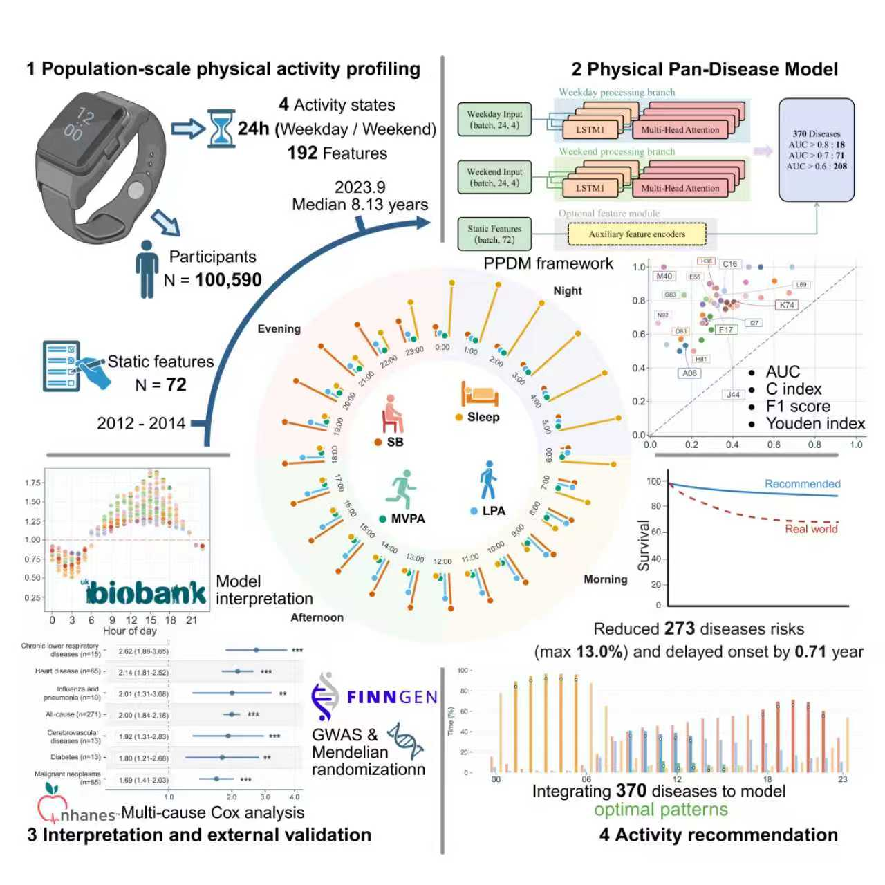

# Pan-Disease Behavioral Clock and PPDM Analysis

This repository provides the full analysis pipeline supporting the study:

**A Pan-Disease Behavioral Clock Atlas Decodes the Architecture of Human Activity for Health Management**

The project develops and applies the **Physical Pan-Disease Model (PPDM)** to decode high-resolution temporal patterns of daily behavior derived from wearable accelerometers and to link these behavioral clocks to disease risk across the human phenome. The pipeline further integrates multi-omics mediation analysis and causal inference to explore biological pathways and population-level behavioral optimization strategies.



---

## Project Overview

Human behavior unfolds in circadian time. This project aims to systematically characterize how the temporal organization of sedentary behavior, physical activity, and sleep encodes disease vulnerability across multiple organ systems.

Using large-scale wearable data and deep learning, the pipeline enables:

- Pan-disease risk modeling based solely on non-invasive behavioral features
- Identification of shared and disease-specific temporal vulnerability windows
- Integration with proteomic and metabolomic profiles to support biological interpretation
- Simulation of population-level, time-structured behavioral reallocations with potential health benefits

All analyses are designed for **population-level inference and hypothesis generation**, rather than individualized clinical decision-making.

---

## Project Structure

```txt
PPDM-Behavioral-Clock/
├── Behavioral_Optimization/ 
│   ├── data_loader.py
│   ├── config.py
│   ├── pattern_generator.py
│   ├── utils.py
│   ├── main.py
│   └── requirements.txt
│
├── Mediation_Analysis/
│   ├── protein.r
│   └── Meta&imm.r
│
├── Mendelian_Randomization/ 
│   └── MR.r
│
├── PPDM/
│   ├── data_processing.py
│   ├── evaluation.py
│   ├── main.py
│   ├── training_pipeline.py
│   ├── model_architecture.py
│   └── requirements.txt
│ 
└── README.md
```

---

## Core Components

### 1. Physical Pan-Disease Model (PPDM)

**Location:** `PPDM/`

PPDM is a deep-learning architecture combining **LSTM networks** with **multi-head self-attention** to model high-resolution behavioral time series.

**Key characteristics:**

- **Input:** 192-dimensional behavioral matrix  
  - 2 day types (weekday / weekend) × 24 hours × 4 behavioral states
- **Behavioral states:**
  - Sedentary behavior
  - Light physical activity
  - Moderate-to-vigorous physical activity (MVPA)
  - Sleep
- Uses only non-invasive wearable-derived behavioral features
- Designed for **pan-disease risk stratification**, not diagnosis

**Outputs:**

- Disease-specific risk scores
- Feature importance across behavioral states and circadian time windows

---

### 2. Temporal Behavioral Optimization

**Location:** `Behavioral_Optimization/`

This module explores model-inferred, population-level actionability through counterfactual simulation.

**Key features:**

- Time-aware reallocation of behavioral states across the 24-hour cycle
- Physiologically realistic constraints (fixed day length, feasible state transitions)
- Subgroup-level optimization (e.g., age and sex strata)

> **Important note:**  
> All estimated risk reductions reflect **simulated, population-level potential**, not empirically observed intervention effects.

---

### 3. Mediation Analysis

**Location:** `Mediation_Analysis/`

Structural equation modeling (SEM) is used to evaluate whether molecular biomarkers statistically mediate associations between behavioral timing and disease risk.

**Outputs include:**

- Direct and indirect (mediated) effects
- Model fit indices (CFI, RMSEA, SRMR)
- False discovery rate (FDR)–adjusted significance estimates

---

### 4. Mendelian Randomization

**Location:** `Mendelian_Randomization/`

Two-sample Mendelian randomization is performed to support causal inference between behavioral traits, molecular mediators, and disease outcomes.

**Methods implemented:**

- Inverse-variance weighted (IVW)
- Weighted median
- MR-Egger

**Additional analyses:**

- Sensitivity analyses for horizontal pleiotropy
- Heterogeneity testing

---

## Installation

### Python Environment

```bash
conda create -n ppdm python=3.10
pip install -r requirements.txt
```

### R Environment

```bash
Rscript requirements.R
```

---

## Data Requirements

This repository does **not** include individual-level UK Biobank or NHANES data.

Expected inputs include:

- Wearable-derived behavioral features (hourly resolution)
- Disease outcome tables (ICD-coded incident events)
- Demographic covariates
- Proteomic and metabolomic measurements
- GWAS summary statistics for Mendelian randomization

Users must obtain and preprocess data in accordance with the access policies of the relevant cohorts.

---

## Validation and Scope

- PPDM performance was evaluated across multiple disease categories
- Generalizability was supported by population-level analyses using NHANES mortality data
- External datasets were used to support robustness and biological interpretation, not as strict clinical validation

---

## Web Resource

An interactive, open-access platform for exploring the pan-disease Behavioral Clock Atlas is available at:

**http://ppdm.zBiolab.cn**

---

## License

This project is released under the **Apache-2.0 License**.

---

## Disclaimer

This repository provides research code for **population-level behavioral epidemiology**.
All findings should be interpreted in the context of observational data. Prospective trials are required before any clinical or public health implementation.
